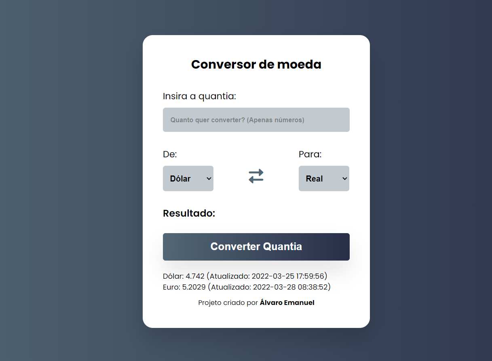
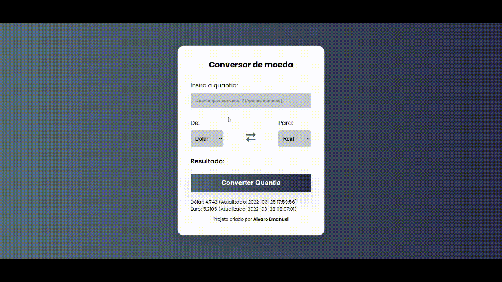

# Conversor de moedas

Precisa comprar algo em uma moeda diferente e quer saber quanto custa em sua moeda? Ou vai viajar e precisa calcular certo quanto vai levar? Então use o conversor de moedas e tenha acesso a uma cotação atualizada a cada 30 segundos com base em dados da [Awesome API Cotação de moedas](https://docs.awesomeapi.com.br/api-de-moedas).

## 📋 Funcionalidades

Para utilizar o conversor basta inserir uma quantia no campo "Insira a quantia:" selecionar a moeda de partida e a final e por fim clicar em "Converter Quantia".

O conversor de moedas possui suporte para as seguintes conversões:
 - Dólar ➡️ Real
 - Real ➡️ Dólar
 - Euro ➡️ Real
 - Real ➡️ Euro
 - Dólar ➡️ Euro
 - Euro ➡️ Dólar

Além disso na parte de baixo da calculadora é possível ver a cotação atualizada das moedas Dólar
 e Euro em relação ao Real. Também é possível trocar rapidamente a moeda de partida e final, apenas clicando nas setas direita-esquerda.

E por fim ao realizar a conversão o resultado traz a moeda formatada.
## ✅ Tecnologias utilizadas

Para criação desse projeto identifiquei que utilizando a programação orientada a objetos seria a melhor escolha. A `class CurrencyConverter` representa os métodos e atributos do conversor. Os atributos relacionados a cotação das moedas deixei privado para evitar problemas.

Para realizar a requisição a API da Awesome API usei o recurso `fetch` do Javascript moderno. A formatação da moeda fiz com o recurso `Intl.NumberFormat` que permite a formatação de acordo com a localização.

**Techs:** HTML, CSS, Javascript

## Exemplo de uso

## 🚀 Sobre
Olá eu sou Álvaro Emanuel, desenvolvedor front-end...

Entre em contato: alvarodiasribeiro16@gmail.com

## 🔗 Links

